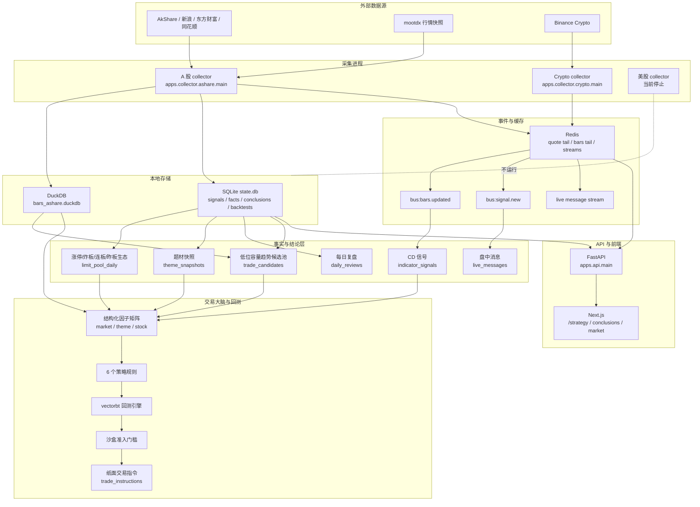
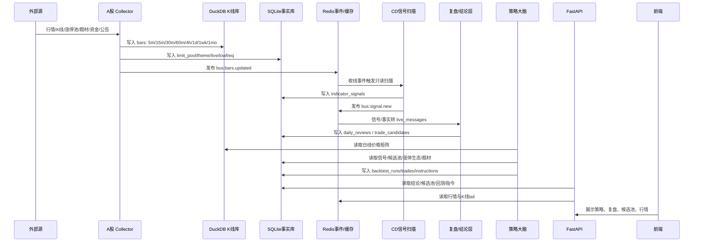
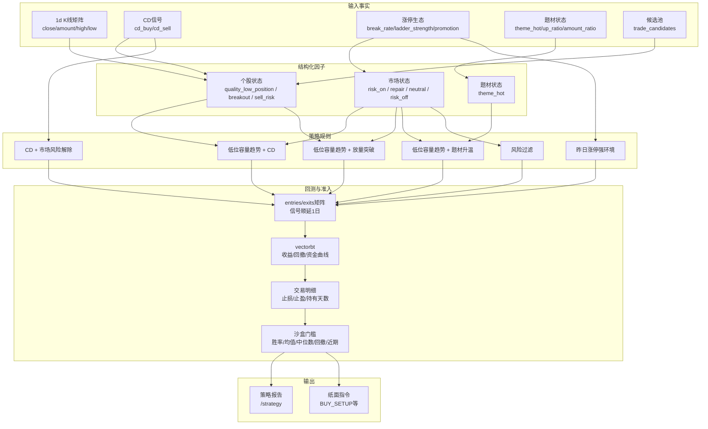

# MarketPulse 总体架构、数据流与接口地图

更新日期: 2026-06-18

本文是 MarketPulse 当前系统的总览入口。读完本文应能回答:

- 数据从哪里来。
- 采集任务分别调用哪些外部接口,用于什么。
- K 线哪些周期入库,哪些周期派生,哪些只展示不入信号。
- 哪些信号会生成,如何进入盘中消息和交易大脑。
- “大脑”如何从事实、复盘因子、候选池和回测结果生成纸面指令。
- 每个关键环节应该继续读哪份子文档。

当前状态:

- 主工作范围:A 股。
- 美股采集:保持停止,不进入当前交易大脑链路。
- Crypto 采集:保留运行,但当前交易大脑第一版只用 A 股。
- 自动下单:不做。
- AI 生成交易建议:不做。

## 1. 总体架构图



## 2. 核心数据流



## 3. 外部接口调用地图

所有 AkShare 调用必须走:

```text
core/integrations/akshare.py::ak_call(name, *args, caller, **kwargs)
```

禁止业务文件直接 `import akshare`。

### A 股行情和 K 线

| 接口/来源 | 调用位置 | 用途 | 入库/输出 |
|---|---|---|---|
| `stock_zh_a_minute` | `core/adapters/ashare.py::fetch_intraday` | A 股 1m/5m/15m/30m/60m 分钟 K 线源 | 5m 稳定入 DuckDB, 1m 仅短缓存展示, 15m/30m 可直拉但当前主链路由 5m 派生 |
| `stock_zh_a_daily` | `core/adapters/ashare.py::fetch_history` | A 股日线前复权 OHLCV 主源 | DuckDB `1d` |
| `stock_zh_a_hist` | `core/adapters/ashare.py` | 日线成交额/换手补充、东财当日兜底、周线直拉 | DuckDB `1d`/`1wk` |
| `stock_zh_index_daily` | `core/adapters/ashare.py` | 指数日线主源 | DuckDB `1d` |
| `stock_zh_index_daily_em` | `core/adapters/ashare.py` | 指数当日东财兜底 | DuckDB `1d` |
| `fund_etf_hist_sina` | `core/adapters/ashare.py` | ETF 日线 | DuckDB `1d` |
| `mootdx.quotes` | `core/adapters/ashare.py` | A 股快照行情 | Redis quote cache / overview |

### 涨停池、炸板池、跌停池、昨板池

| 接口 | 调用位置 | 用途 | 入库/输出 |
|---|---|---|---|
| `stock_zt_pool_em` | `core/services/limit_pool_service.py` | 当日涨停池 | `limit_pool_daily(pool_type=limit_up)` |
| `stock_zt_pool_zbgc_em` | `core/services/limit_pool_service.py` | 炸板池 | `limit_pool_daily(pool_type=broken_limit)` |
| `stock_zt_pool_dtgc_em` | `core/services/limit_pool_service.py` | 跌停池 | `limit_pool_daily(pool_type=down_limit)` |
| `stock_zt_pool_previous_em` | `core/services/limit_pool_service.py` | 昨日涨停今日表现 | `limit_pool_daily(pool_type=previous)` |

这些数据进一步计算:

- 炸板率。
- 跌停数。
- 最高连板。
- 二板以上数量。
- 连板梯队连续度。
- 连板强度。
- 昨日涨停晋级率。
- 昨日涨停红盘率。
- 高位票晋级率。
- 高位票淘汰惩罚。

### 盘中异动和板块异动

| 接口 | 调用位置 | 用途 | 入库/输出 |
|---|---|---|---|
| `stock_changes_em` | `core/services/market_changes_service.py` | 火箭发射、快速反弹、加速下跌、高台跳水、封涨停、打开涨停、竞价异动 | `stock_changes` |
| `stock_board_change_em` | `core/services/market_changes_service.py` | 板块异动、主力净流入、异动次数 | `board_changes` |

### 资金、筹码、行业

| 接口 | 调用位置 | 用途 | 入库/输出 |
|---|---|---|---|
| `stock_individual_fund_flow` | `core/services/fund_flow_service.py` | 个股主力资金流 | `fund_flow` |
| `stock_hsgt_hist_em` | `core/services/fund_flow_service.py` | 北向资金 | `fund_flow` |
| `stock_cyq_em` | `core/services/chip_service.py` | 筹码分布、获利比例、成本集中度 | `chip_summary` |
| `sw_index_first_info` | `core/services/sw_industry_service.py` | 申万一级行业列表 | 行业库 |
| `sw_index_daily` 相关 | `core/services/sw_industry_service.py` | 申万行业日线 | 行业走势和复盘板块位置 |

### 盘后低频事实

| 接口 | 调用位置 | 用途 | 入库/输出 |
|---|---|---|---|
| `stock_lhb_detail_em` | `core/services/lowfreq_fact_service.py` | 龙虎榜明细 | 低频事实表 |
| `stock_notice_report` | `core/services/lowfreq_fact_service.py` | 公告 | 低频事实表 |
| `stock_fund_flow_individual` | `core/services/lowfreq_fact_service.py` | 同花顺个股资金流 | 低频事实表 |
| `stock_fund_flow_concept` | `core/services/lowfreq_fact_service.py` | 同花顺概念资金流 | 低频事实表 |
| `stock_fund_flow_industry` | `core/services/lowfreq_fact_service.py` | 同花顺行业资金流 | 低频事实表 |

### 目录和市场查询

| 接口 | 调用位置 | 用途 |
|---|---|---|
| `stock_zh_a_spot` | `core/services/symbol_directory_service.py` | A 股目录刷新,当前有跳过逻辑避免 mini_racer 污染 |
| `fund_etf_category_sina` | `core/services/symbol_directory_service.py` | ETF 目录 |
| `stock_zh_a_spot_em` | `core/services/market_query.py` | A 股市场查询/涨跌榜 |
| `stock_board_industry_name_em` | `core/services/market_query.py` | 行业板块列表 |
| `stock_board_concept_name_em` | `core/services/market_query.py` | 概念板块列表 |
| `stock_board_concept_cons_em` | `core/services/market_query.py` | 概念成分 |
| `stock_board_industry_cons_em` | `core/services/market_query.py` | 行业成分 |

## 4. 采集任务与调度

### 常驻任务

| 任务 | 位置 | 频率/触发 | 作用 |
|---|---|---|---|
| 行情快照 tick | `core/scheduler/scheduler.py::build_scheduler` | 10 秒 | 更新 quote cache |
| A 股 bar poller | `apps/collector/ashare/bar_poller.py` | 交易时段 slot 调度,5 秒扫描,每标的分摊到 5 分钟窗口 | 拉 5m 收线 K 线,写 DuckDB/Redis,发布 bars.updated |
| quote bar ticker | `apps/collector/ashare/quote_bar_ticker.py` | 10 秒 | 用快照生成进行中 K 线 |
| intraday line writer | `apps/collector/ashare/intraday_line_writer.py` | 10 秒 | 写分时线 |
| market changes worker | `apps/collector/ashare/market_changes_worker.py` | 盘中循环 | 拉盘口/板块异动 |
| signal scan consumer | `apps/collector/jobs/signal_scan_consumer.py` | `bus:bars.updated` 事件 | 只读已入库 bar 生成 CD 信号 |
| live message consumer | `apps/collector/jobs/live_message_consumer.py` | `bus:signal.new` 等事件 | 把信号/事实转 live_messages |

### A 股定时任务

| 任务 | 时间 | 作用 |
|---|---:|---|
| 涨停/炸板/跌停/昨板池 | 交易日 09:05-15:55,每小时 5/15/25/35/45/55 分 | 刷新 `limit_pool_daily` |
| 申万行业日线 | 15:40 | 更新行业位置 |
| 筹码预热 | 15:35 | 预热 watchlist 筹码 |
| 每日复盘 | 15:50 | 生成日线+消息层复盘 |
| 低位容量趋势候选池 | 15:55 | 生成 `trade_candidates` |
| 策略回测 | 16:05 | 生成回测和纸面指令 |
| 低频事实 | 18:10 | 龙虎榜、公告、低频资金 |
| 每日复盘低频刷新 | 18:20 | 低频事实补入复盘 |
| 策略回测低频刷新 | 18:30 | 低频后再跑一次 |
| 分时数据清理 | UTC 02:30 | 清理 90 天前分时 |
| 信号摘要 | 每 30 分钟 | 发送/生成信号摘要 |
| CD 补扫兜底 | 每 30 分钟 | 防事件丢失,只读已存 bar 幂等补扫 |

## 5. K 线周期与入库口径

单一事实源:

- `core/domain/intervals.py`

| 周期 | 是否 K 线展示 | 是否 CD 信号 | A 股入库方式 | 说明 |
|---|---:|---:|---|---|
| `1m` | 否,已被分时图取代 | 否 | 不稳定入 DuckDB,进程短缓存 | 详情分时短缓存,避免频繁 AkShare |
| `5m` | 是 | 否 | 直接从 `stock_zh_a_minute(period=5)` 拉取入 DuckDB | A 股 intraday 源头周期 |
| `15m` | 是 | 是 | 由 5m 收线事件聚合派生,必要时可直拉 | 用于 K 线和 CD |
| `30m` | 是 | 是 | 由 5m 收线事件聚合派生,必要时可直拉 | 用于 K 线和 CD |
| `60m` | 是 | 是 | 由 5m 聚合,按 A 股 session 富途口径切桶 | 用于 K 线和 CD |
| `4h` | 是 | 是 | 由 5m 聚合 | A 股近似大周期信号 |
| `1d` | 是 | 是 | 盘中由 5m 合成 `final=false`,收盘由 daily settlement 写 `final=true` | 策略回测主周期 |
| `1wk` | 是 | 否 | 由 1d resample,也可通过 `stock_zh_a_hist(period=weekly)` 回填 | 展示/趋势 |
| `1mo` | 是 | 否 | 由 1d resample | 展示/趋势 |

时间戳口径:

- 日线 `1d`:BJT 自然交易日 00:00 转 UTC。
- A 股 intraday:bar close 时刻。
- 5m/15m/30m/60m/4h 的信号扫描只读已收线 bar。

## 6. 会生成哪些信号

### 技术信号

| 信号 | 生成位置 | 输入 | 输出 | 用途 |
|---|---|---|---|---|
| CD 买点 | `core/indicators/cd.py` + `core/services/signal_service.py` | 已入库 K 线 | `indicator_signals(signal_type=buy)` | 盘中消息、策略买入条件 |
| CD 卖点 | 同上 | 已入库 K 线 | `indicator_signals(signal_type=sell)` | 盘中消息、策略退出条件 |

扫描周期:

- `15m`
- `30m`
- `60m`
- `4h`
- `1d`

### 事实信号

| 信号/事实 | 来源 | 输出 | 用途 |
|---|---|---|---|
| 涨停封板 | `stock_changes_em` / `limit_pool_daily` | `stock_changes` / `limit_pool_daily` | 情绪和短线生态 |
| 打开涨停板/炸板 | `stock_changes_em` / `stock_zt_pool_zbgc_em` | `stock_changes` / `limit_pool_daily` | 风险过滤 |
| 跌停扩散 | `stock_zt_pool_dtgc_em` | `limit_pool_daily` | risk_off |
| 连板生态 | `stock_zt_pool_em` 的 `ladder_count` | 结构化因子 | 短线强弱和昨板策略门控 |
| 昨日涨停表现 | `stock_zt_pool_previous_em` | 结构化因子 | 晋级率、红盘率、淘汰惩罚 |
| 题材升温 | `theme_snapshots` | `theme_hot` | 题材策略和复盘 |
| 龙虎榜/公告/低频资金 | 低频接口 | 低频事实 | 复盘增强,暂不做硬门控 |

### 交易候选和纸面指令

| 类型 | 生成位置 | 输出 |
|---|---|---|
| 低位容量趋势观察候选 | `core/services/watch_candidate_service.py` | `trade_candidates` |
| 策略回测报告 | `core/services/strategy_backtest_service.py` | `strategy_backtest_runs` / `strategy_backtest_trades` |
| 纸面指令 | `core/services/strategy_backtest_service.py::_generate_instructions` | `trade_instructions` |

## 7. 大脑执行架构



### 大脑读取什么

读取:

- DuckDB 日线价格矩阵。
- SQLite CD 信号。
- SQLite 涨停生态。
- SQLite 题材快照。
- SQLite 候选池。

不读取:

- 复盘自然语言文本。
- AI 输出。
- API 请求时实时外部数据。

### 市场状态

```text
risk_off =
  炸板率 >= 45%
  OR 跌停数 >= 20
  OR 昨板淘汰惩罚 <= -5%
  OR 高位淘汰惩罚 <= -6%
  OR 连板生态坍塌且炸板偏高
  OR 宽基下跌且上涨家数 <= 35%

risk_on =
  晋级率 / 涨停数 / 上涨家数达标
  AND 连板强度或二板以上广度达标
  AND 炸板 / 跌停 / 淘汰惩罚不过线

repair =
  非 risk_on / risk_off
  AND 晋级率 >= 20% 或上涨家数 >= 55%
```

### 沙盒准入门槛

```text
交易数 >= 80
AND 胜率 >= 53%
AND 平均收益 >= 2.5%
AND 中位数收益 > 0
AND 最大回撤 > -18%
AND 最新年度平均收益非负
```

没有策略通过时:

- 不生成 `BUY_SETUP`。
- 旧 active 指令自动过期。
- `/api/strategy/instructions` 返回空列表。

## 8. 内部 API 地图

### 策略和交易大脑

| API | 作用 | 数据源 |
|---|---|---|
| `GET /api/strategy/backtests` | 策略回测列表 | `strategy_backtest_runs` |
| `GET /api/strategy/backtests/{strategy_id}` | 策略详情、资金曲线、交易明细 | `strategy_backtest_runs` + `strategy_backtest_trades` |
| `GET /api/strategy/instructions` | 当前纸面指令 | `trade_instructions` |

### 结论层

| API | 作用 | 数据源 |
|---|---|---|
| `GET /api/conclusions/intraday` | 当前窗口盘中结论 | `live_messages` + `theme_snapshots` + `limit_pool_daily` |
| `GET /api/conclusions/intraday-rounds` | 30 分钟结论轮 | 同上,读时按窗切片 |
| `GET /api/conclusions/daily-review` | 每日复盘 | `daily_reviews`,无存档时即时降级计算 |
| `GET /api/conclusions/daily-review/dates` | 已生成复盘日期 | `daily_reviews` |
| `GET /api/conclusions/candidates` | 低位容量趋势候选池 | `trade_candidates` |

### 市场变化

| API | 作用 |
|---|---|
| `GET /api/markets/ashare/changes` | 个股异动 |
| `GET /api/markets/ashare/changes/boards` | 板块异动 |
| `GET /api/markets/ashare/changes/limit-pool` | 涨停/炸板/跌停/昨板池明细 |
| `GET /api/markets/ashare/changes/limit-pool/summary` | 涨停生态摘要 |

## 9. 当前入库表与用途

| 存储 | 表/文件 | 作用 |
|---|---|---|
| DuckDB | `data/bars_ashare.duckdb` | A 股 K 线 |
| DuckDB | `data/intraday_ashare.duckdb` | 分时线 |
| SQLite | `indicator_signals` | CD 买卖信号 |
| SQLite | `limit_pool_daily` | 涨停/炸板/跌停/昨板生态 |
| SQLite | `theme_snapshots` | 题材快照 |
| SQLite | `live_messages` | 盘中消息和信号消息 |
| SQLite | `daily_reviews` | 每日复盘存档 |
| SQLite | `trade_candidates` | 观察候选池 |
| SQLite | `strategy_backtest_runs` | 策略回测摘要 |
| SQLite | `strategy_backtest_trades` | 策略交易明细 |
| SQLite | `trade_instructions` | 纸面交易指令 |
| SQLite | 低频事实表 | 龙虎榜/公告/资金事实 |
| Redis | quote cache | 行情快照 |
| Redis | bars tail | API K 线读路径 |
| Redis | streams | bars/signal/live-message 事件 |

## 10. 关键子文档指引

| 主题 | 文档 |
|---|---|
| 交易大脑、策略、回测闭环 | [strategy_brain_system.md](/Users/xiangrong/stock/marketpulse/docs/strategy_brain_system.md) |
| A 股盘中看盘能力和启动流程 | [2026-06-15-ashare-intraday-watch-runbook.md](/Users/xiangrong/stock/marketpulse/docs/2026-06-15-ashare-intraday-watch-runbook.md) |
| 结论层设计 | [2026-06-17-market-conclusion-layer-design.md](/Users/xiangrong/stock/marketpulse/docs/2026-06-17-market-conclusion-layer-design.md) |
| 数据源和 API 说明 | [data-sources-and-apis.md](/Users/xiangrong/stock/marketpulse/docs/data-sources-and-apis.md) |
| 分钟聚合与时间戳口径 | [intraday_aggregation.md](/Users/xiangrong/stock/marketpulse/docs/intraday_aggregation.md) |
| 未完成事项 | [TODO.md](/Users/xiangrong/stock/marketpulse/docs/TODO.md) |
| 原始完整设计 | [2026-05-13-marketpulse-design.md](/Users/xiangrong/stock/marketpulse/docs/superpowers/specs/2026-05-13-marketpulse-design.md) |

## 11. 当前已知边界

1. 涨停生态历史不足。
   - 本地 `limit_pool_daily` 真实历史当前很短。
   - 长周期回测中连板/昨板因子只对有数据日期生效,其余日期用宽基上涨家数兜底。

2. 题材历史不足。
   - `低位容量趋势 + 题材升温` 样本过少。

3. 候选池历史不足。
   - 当前能生成实时 `trade_candidates`。
   - 历史回测仍主要使用 K 线结构代理。

4. 执行约束仍是近似。
   - 已做信号顺延、手续费、滑点、T+1 近似。
   - 尚未完整建模涨停买不到、跌停卖不出、集合竞价滑点。

5. 当前没有策略进入沙盒。
   - `/api/strategy/instructions` 应为空。
   - 这是正确行为,代表交易大脑没有找到足够强的统计优势。

## 12. 验证命令

```bash
. .venv/bin/activate && python -c "from apps.api.main import app"
cd apps/web && npx tsc --noEmit
. .venv/bin/activate && pytest tests/unit -q
grep -rn --include="*.py" "^import akshare\|^from akshare" core apps tests
```

策略接口冒烟:

```bash
curl -s http://localhost:8787/api/strategy/backtests
curl -s http://localhost:8787/api/strategy/instructions
```
